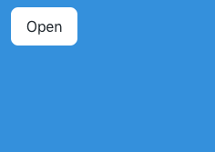
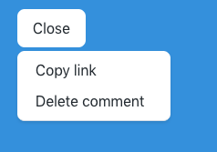
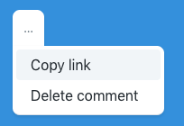

# TailwindCSS Open Variant

[](LICENSE.md)

Open variant for TailwindCSS, to use with the HTML `<details>` tag and apply styles only when the element is open.

<!-- TOC -->

- [TailwindCSS Open Variant](#tailwindcss-open-variant)
    - [💾 Installation](#💾-installation)
    - [📝 Usage](#📝-usage)
    - [🔖 Changelog](#🔖-changelog)
    - [⬆️ Upgrading](#⬆️-upgrading)
    - [🎉 Contributing](#🎉-contributing)
    - [👷 Credits](#👷-credits)
    - [♻️ License](#♻️-license)

<!-- /TOC -->

## 💾 Installation

You can install the package with [npm](https://www.npmjs.com/) or [yarn](https://yarnpkg.com/) using the following commands:

```bash
# With NPM
npm install tailwindcss-open-variant --save-dev

# With Yarn
yarn add tailwindcss-open-variant --dev
```

Once installed, require it as a plugin in your Tailwind config file.

```js
plugins: [
  // Other plugins...

  require('tailwindcss-open-variant')(),
],
```

Finally, add the `open` variant as variants to your desired modules.

```js
modules: {
    // Other modules...

    backgroundColors: ['responsive', 'hover', 'focus', 'open'],
    borderColors: ['responsive', 'hover', 'focus', 'group-hover', 'open'],
    borderRadius: ['responsive', 'hover', 'group-hover', 'open'],
    borderStyle: ['responsive', 'open'],
    display: ['responsive', 'open'],
    shadows: ['responsive', 'hover', 'focus', 'open'],
    textColors: ['responsive', 'hover', 'focus', 'group-hover', 'open'],
},
```

## 📝 Usage

Once installed, you can prefix your defined utilities with `open:` to apply them only when the current details tag, or the parent details tag of the given node, is opened.

You can use this to, for example, display a dropdown menu where the button text changes depending on whether it is open or not:





```html
<details class="inline-block">
    <summary class="cursor-pointer select-none align-middle whitespace-no-wrap outline-none rounded-lg focus:outline-none focus:shadow-outline" aria-haspopup="menu">
        <span class="button rounded-lg inline-block open:hidden">Open</span>
        <span class="button rounded-lg hidden open:inline-block">Close</span>
    </summary>
    <div class="absolute" role="menu">
        <div class="relative bg-white border-t border-b shadow min-w-xs flex flex-col border-t-0 rounded-lg rounded-tl-none p-1 text-left">
            <a href="#" class="px-4 py-2 block rounded no-underline focus:shadow-outline text-black hover:bg-grey-lighter">Copy link</a>
            <a href="#" class="px-4 py-2 block rounded no-underline focus:shadow-outline text-black hover:bg-grey-lighter">Delete comment</a>
        </div>
    </div>
</details>
```

You can also manipulate styles depending on the open state, so as to make the summary fit in with the newly shown element.




```html
<details class="inline-block">
    <summary class="cursor-pointer select-none align-middle whitespace-no-wrap outline-none rounded-lg focus:outline-none focus:shadow-outline" aria-haspopup="menu">
        <span class="flex items-center cursor-pointer text-sm border-grey rounded-lg py-1 px-2 text-grey-dark focus:shadow hover:shadow open:shadow open:rounded-b-none open:text-grey-darker bg-white p-3">
            &hellip;
        </span>
    </summary>
    <div class="absolute" role="menu">
        <div class="relative bg-white border-t border-b shadow min-w-xs flex flex-col border-t-0 rounded-lg rounded-tl-none p-1 text-left">
            <a href="#" class="px-4 py-2 block rounded no-underline focus:shadow-outline text-black hover:bg-grey-lighter">Copy link</a>
            <a href="#" class="px-4 py-2 block rounded no-underline focus:shadow-outline text-black hover:bg-grey-lighter">Delete comment</a>
        </div>
    </div>
</details>
```

## 🔖 Changelog

Please see [the changelog file](CHANGELOG.md) for more information on what has changed recently.

## ⬆️ Upgrading

Please see the [upgrading file](UPGRADING.md) for details on upgrading from previous versions.

## 🎉 Contributing

Please see the [contributing file](CONTRIBUTING.md) and [code of conduct](CODE_OF_CONDUCT.md) for details on contributing to the project.

## 👷 Credits

- [Liam Hammett](https://github.com/imliam)
- [All Contributors](../../contributors)

## ♻️ License

The MIT License (MIT). Please see the [license file](LICENSE.md) for more information.
